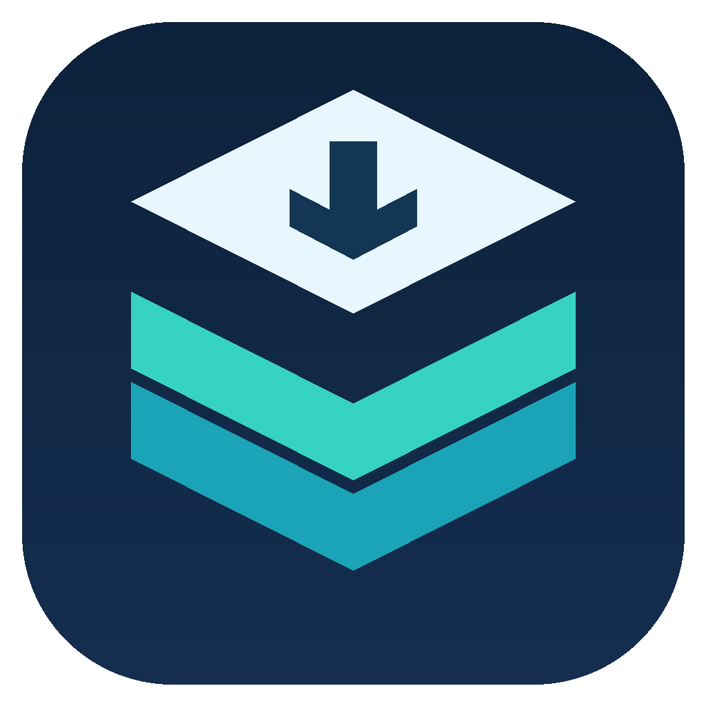

<p align="center">
  
</p>

<p align="center">
  <a href="https://github.com/micro23/Torrent-Deck/actions/workflows/torrent-deck-release.yml"></a>
  <a href="https://github.com/micro23/Torrent-Deck/releases"></a>
  <a href="https://github.com/micro23/Torrent-Deck/releases"></a>
</p>

# Torrent-Deck

Torrent-Deck is a desktop remote-control application for managing torrents on clients running elsewhere: a home computer, NAS, VPS, or seedbox. It connects to the client’s web/API interface, so the torrent client and its download storage remain on your server.

## Download and platform status

Download published installers from [GitHub Releases](https://github.com/micro23/Torrent-Deck/releases). Releases provide macOS packages and a Windows installer. Linux support remains in the shared source and packaging configuration while its release builds are deferred.

Universal macOS ZIPs are built for both Intel and Apple Silicon. When signing and notarization credentials are unavailable, the ZIP is unsigned and macOS may block it as damaged; signing is required for normal Gatekeeper-approved launching. Signed macOS releases check GitHub for updates and download the compatible ZIP. Windows checks GitHub and installs approved updates through its NSIS installer. Windows may show a SmartScreen warning because the installer is unsigned.

Install Torrent-Deck and launch it once to register torrent files. Your existing fork profiles and certificates migrate into a separate Torrent-Deck profile. Updates are checked against the public [Torrent-Deck GitHub Releases](https://github.com/micro23/Torrent-Deck/releases). See [release and update details](docs/github-releases.md).

## Supported torrent clients

Torrent-Deck connects to these clients through their remote interfaces:

- [µTorrent](https://www.utorrent.com/)
- [qBittorrent](https://www.qbittorrent.org/)
- [Transmission](https://transmissionbt.com/)
- [rTorrent](https://rakshasa.github.io/rtorrent/)
- [Synology Download Station](https://www.synology.com/en-global/knowledgebase/DSM/help/DownloadStation/DownloadStation_desc)
- [Deluge](https://deluge-torrent.org/)
- [aria2](https://aria2.github.io/)

A mock client is also included for development and testing; it is not a production torrent backend. Client versions and server configuration can affect compatibility. For rTorrent, the XML-RPC endpoint must be configured correctly; see the [rTorrent RPC setup guide](https://github.com/rakshasa/rtorrent/wiki/RPC-Setup-XMLRPC).

## What changed since the fork

See [CHANGELOG.md](CHANGELOG.md) for the changes from the original Electorrent to the current Torrent-Deck release, including platform registration, Deluge uploads, themes, update behavior, and testing policy.

## Features

- Deluge torrent files use the authenticated API; failed adds show the server error and keep the file for retry. Optional preview parsing cannot prevent adding a file.
- Manage several remote client/server profiles and switch between them.
- Add torrents by opening `.torrent` files, dragging and dropping them, pasting magnet links, or using the browser magnet protocol handler. Installed macOS and Linux apps reclaim `.torrent` file association on launch. Windows registers Torrent-Deck and opens Default Apps for the one-time user choice. Help → Make Torrent-Deck Default for Torrent Files repeats setup when needed.
- Search and filter torrents, including fuzzy matching.
- View current torrent states, including checking/verifying, queued, paused, downloading, seeding, and errors, alongside progress, transfer rates, peers, trackers, and file information.
- Keep torrent details separate from selection: clicking a row opens its information, while checkboxes select torrents for actions.
- Use the themed bottom action menu on every theme to start, pause, or remove selected torrents, individually or in bulk.
- Choose between removing a torrent only or removing it with downloaded files when the client supports file deletion.
- Configure table columns, resize them, and double-click a column divider to fit its contents.
- Use native desktop notifications and configure certificate trust for self-signed HTTPS endpoints.
- Choose from 38 bundled themes, including Darkhand, Terminal, Matrix, five redesigned core themes, and seasonal and sports styles. Theme assets and refreshed gallery previews are bundled locally.
- Use the Darkhand dashboard’s live transfer statistics and history, and arrange statistics and torrent details to suit the window.
- Check this project’s GitHub Releases from Help or Settings to compare the installed and latest versions, then choose Download Update. macOS offers the downloaded ZIP for manual installation; platform-specific update behavior is described in the [release guide](docs/github-releases.md).

Feature availability can vary by client. Removing a torrent’s downloaded data is destructive, so check the confirmation and selected removal option before proceeding.

## Getting started

1. Install and start one of the supported torrent clients on the machine that will store and download the files.
2. Enable that client’s remote interface (Web UI, HTTP API, JSON-RPC, or XML-RPC, depending on the client). Keep its address and port handy.
3. Install and open Torrent-Deck, then add a server profile for your client.
4. Select the client type and enter the server address, port, and any required URL path, username, and password. For HTTPS with a self-signed certificate, configure trust in Torrent-Deck’s certificate settings.
5. Connect to the profile. Add a torrent using a magnet link or a `.torrent` file. Downloads run on the remote client and are saved to its configured storage location.

Do not expose a torrent client’s remote interface to the public internet without appropriate authentication and network protections. Consult the client’s own documentation for enabling its remote interface and configuring access.

## Build from source

The project uses Node.js (version specified in [`.nvmrc`](.nvmrc)), npm, TypeScript, and Electron. On macOS:

```sh
npm install
npm run build
npm run app
```

To make a local macOS distribution build:

```sh
npm run build
npm run dist -- --mac
```

Useful checks during development:

```sh
npm run lint
npm run build
npm test -- --client deluge:2 --spec test/specs/standard/torrent-uploads.spec.ts --headless
```

Client testing currently targets Deluge only. Other client tests require an explicit request. Cross-platform source support is maintained, while Windows and Linux packaging is deferred during macOS refinement. See [docs/github-releases.md](docs/github-releases.md) for release validation.

## Contributing

Bug reports, client compatibility reports, and pull requests are welcome. Please include your operating system, Torrent-Deck version, torrent-client name/version, and relevant logs or steps to reproduce. Avoid posting passwords, private tracker URLs, or other sensitive details.

## Original project, authors, and credits

This repository is an independently maintained continuation of [Electorrent by tympanix](https://github.com/tympanix/Electorrent). The original project established the desktop app, client integrations, and torrent-management workflow that this project builds upon. We are grateful to the original author and contributors for that foundation. This fork has since moved to a modernized application codebase and adds its own interface, themes, platform work, and release process.

This project is maintained at [micro23/Torrent-Deck](https://github.com/micro23/Torrent-Deck). It is not an official release of the original project and is not affiliated with its original maintainers. Electorrent is licensed under [GPL-3.0](LICENSE); see the license and original repository for project history and attribution.

The Deck-inspired theme collection was ported from [Deluge Deck](https://github.com/micro23/deluge-deck), which is kept as a separate, read-only reference project. Torrent-Deck remains a remote client for multiple BitTorrent applications; it does not require Deluge Deck or install a plugin into it.

See [CREDITS.md](CREDITS.md) for upstream author and contributor attribution, dependency credits, and preserved licensing.

### Acknowledgments

- [tympanix/Electorrent](https://github.com/tympanix/Electorrent) and its contributors, for the original application and the foundation this project continues.
- [micro23/deluge-deck](https://github.com/micro23/deluge-deck), for the separate Deck theme reference and design assets adapted for Electorrent.
- The maintainers of the supported BitTorrent clients and the open-source projects this application depends on.
